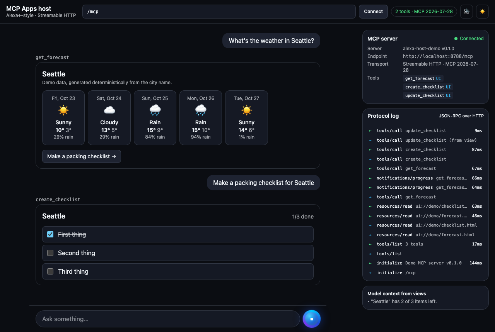
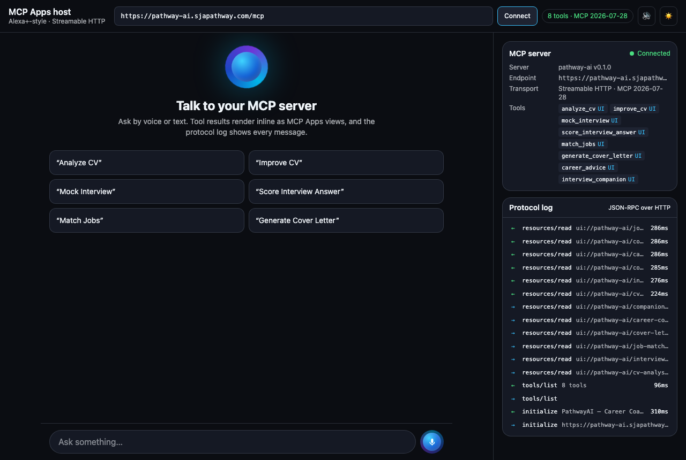

# MCP Apps Alexa+-style host

**Talk to any MCP server the way Alexa+ would.** This host discovers a server's tools, routes what you say (by voice or text) to the right tool, renders each tool's [MCP Apps](https://github.com/modelcontextprotocol/ext-apps) view inline in the conversation, and shows every JSON-RPC message in a live protocol inspector.

**[Live demo →](https://mcp-apps-alexa-host.sja-affu765.workers.dev)** · [connected to PathwayAI's 8-tool server](https://mcp-apps-alexa-host.sja-affu765.workers.dev/?server=https://pathway-ai.sjapathway.com/mcp)

It's a working reference for the part MCP Apps leaves to you: **the host**. Use it to test your own server, as a starting point for your own assistant UI, or to copy the pieces that are easy to get wrong.



## Why this exists

Building an MCP Apps *view* is well documented. Building a *host* that renders those views is not: the `ext-apps` package ships no runnable host example, and the `AppBridge` lifecycle has ordering rules that silently break views when you get them wrong. I hit this while building an Alexa+ career-coach submission for the Amazon Build, Ship, Shape hackathon, and extracted the host as a standalone, server-agnostic starter.

## Features

- **Works with any Streamable HTTP MCP server.** Paste a URL, or open `/?server=https://your-server/mcp`.
- **Latest protocol.** The host negotiates MCP **2026-07-28** via `server/discover`, and falls back to 2025 (2025-11-25, 2025-03-26) for older servers.
- **MCP Apps rendering.** Views run in sandboxed iframes through the official `AppBridge`:
  - Tool input and result delivery.
  - Views calling server tools, including app-only tools (`visibility: ["app"]`).
  - Follow-up messages from views (`ui/message`) and model-context updates.
  - Theme sync and auto-resize, plus link opening and microphone permission.
- **Voice in, voice out.** Web Speech API dictation and spoken replies, with an Alexa-style light ring.
- **Live progress.** `notifications/progress` stages appear as the tool runs.
- **Protocol inspector.** Every request, response and notification is shown with timings, and large arguments are redacted.
- **Router you can swap.** A built-in keyword router needs no model and works offline, built only from `tools/list` (names, descriptions, input schemas). Replace it with an LLM in one function.
- **Batteries included.** A tiny demo MCP server (forecast and checklist tools with views), deployed alongside the host as one Cloudflare Worker.

| Bundled demo server | Pointed at a real server ([PathwayAI](https://pathway-ai.sjapathway.com)) |
| --- | --- |
|  |  |

## Quick start

```bash
git clone https://github.com/sja-thedude/mcp-apps-alexa-host.git
cd mcp-apps-alexa-host
nvm use        # Node 22
npm install
npm run dev    # builds the views, then serves host + demo server on http://localhost:8787
```

Then try *"What's the weather in Seattle?"*, click **Make a packing checklist**, and tick an item. Watch the protocol log on the right.

**Point it at your server:** paste the URL into the bar at the top, or open `http://localhost:8787/?server=https://your-server.example/mcp`.

**Deploy:** set your own `account_id` in `wrangler.jsonc` (or remove it), then run `npm run deploy` to publish the host and demo server as one Cloudflare Worker.

## Requirements for your server

- **Streamable HTTP** (a POST endpoint, JSON or SSE responses).
- **CORS** if the host runs on another origin. Allow these request headers:
  ```
  content-type, accept, authorization, mcp-session-id, mcp-protocol-version, mcp-method, mcp-name, last-event-id
  ```
  `mcp-method` and `mcp-name` are sent by 2026-07-28 clients. Without them the preflight fails, and clients fall back to the 2025 handshake (or fail).
- **Views** as MCP Apps resources: tools declare `_meta.ui.resourceUri`, and resources are served as `text/html;profile=mcp-app`.
- **For Alexa+:** also return `_meta.ui` on each tool *result* (`resourceUri`, plus optional `invoking` / `invoked` status text), as shown in Amazon's Alexa+ MCP client lifecycle docs. The demo server does both.

## The AppBridge rules that are easy to miss

From `src/host/lib/AppFrame.tsx`:

1. **Connect the bridge before loading the view.** Create `new PostMessageTransport(iframe.contentWindow, iframe.contentWindow)` and `await bridge.connect(transport)` **before** setting `iframe.srcdoc`. Otherwise the view's `ui/initialize` arrives before anyone is listening.
2. **Send input and results only after `oninitialized`**, and buffer a result that arrives before the view is ready.
3. **Use a `null` client with your own `oncalltool`** if you want to log or redact view-initiated calls. Passing a `Client` forwards them invisibly.
4. **Mount views with a stable key** per tool call, and clear them when switching servers, so a view never renders against the wrong server.

## Use the pieces in your own app

```tsx
import { McpHost } from "./lib/mcpHost";
import { AppFrame } from "./lib/AppFrame";

const host = new McpHost("https://your-server.example/mcp");
await host.connect();                                   // negotiates the protocol, lists tools, prefetches views
const tool = host.tool("get_forecast")!;
const result = await host.callTool(tool.name, { city: "Seattle" }, "assistant", (msg) => console.log(msg));

<AppFrame host={host} uri={tool.uiUri!} toolName={tool.name} args={{ city: "Seattle" }}
          result={result} theme="dark" onMessage={sendToAssistant} onContext={rememberForModel} />
```

## Swap in an LLM router

The built-in router scores tools against the utterance and extracts arguments from each tool's input schema. For real assistants, plug in a model:

```tsx
import type { Router } from "./lib/router";

const llmRouter: Router = async (utterance, tools) => {
  const res = await fetch("/api/route", {
    method: "POST",
    body: JSON.stringify({ utterance, tools: tools.filter((t) => t.modelVisible) }),
  });
  const { tool, arguments: args } = await res.json();  // ask your model for {"tool", "arguments"}
  const match = tools.find((t) => t.name === tool);
  return match ? { tool: match, arguments: args, score: 1 } : null;
};

<App router={llmRouter} />
```

## Project layout

```text
src/
├── host/                 The Alexa+-style host (Vite + React)
│   ├── App.tsx           Conversation, voice, server URL, view rendering
│   ├── lib/mcpHost.ts    MCP client: negotiation, tool discovery, calls, progress, protocol log
│   ├── lib/AppFrame.tsx  Sandboxed iframe + AppBridge (the lifecycle rules above)
│   ├── lib/router.ts     Keyword router and schema-based argument extraction
│   └── lib/speech.ts     Dictation and speech synthesis
├── server/               Demo MCP server on Cloudflare Workers (createMcpHandler)
└── views/                Demo MCP Apps views (forecast, checklist), built to single HTML files
test/                     Router, demo server, MCP and Worker tests (Vitest)
scripts/                  View build, browser end-to-end check
```

## Scripts

| Command | What it does |
| --- | --- |
| `npm run dev` | Host + demo server on :8787 |
| `npm run dev:host` | Hot-reloading host on :5173 (proxies `/mcp` to :8787) |
| `npm test` | Unit and MCP tests |
| `npm run typecheck` | Strict TypeScript |
| `npm run e2e -- <baseUrl> [otherMcpUrl]` | Browser test: views, view → server calls, follow-up messages, and connecting to another server |
| `npm run deploy` | Deploy to Cloudflare Workers |

## Built with

[MCP TypeScript SDK v2](https://github.com/modelcontextprotocol/typescript-sdk) · [MCP Apps (`@modelcontextprotocol/ext-apps`)](https://github.com/modelcontextprotocol/ext-apps) · React · Tailwind CSS · Vite · Cloudflare Workers · Web Speech API.

Contributions are welcome. See [CONTRIBUTING.md](CONTRIBUTING.md).

## License

[MIT](LICENSE) © 2026 Syeda Juveria Afreen
